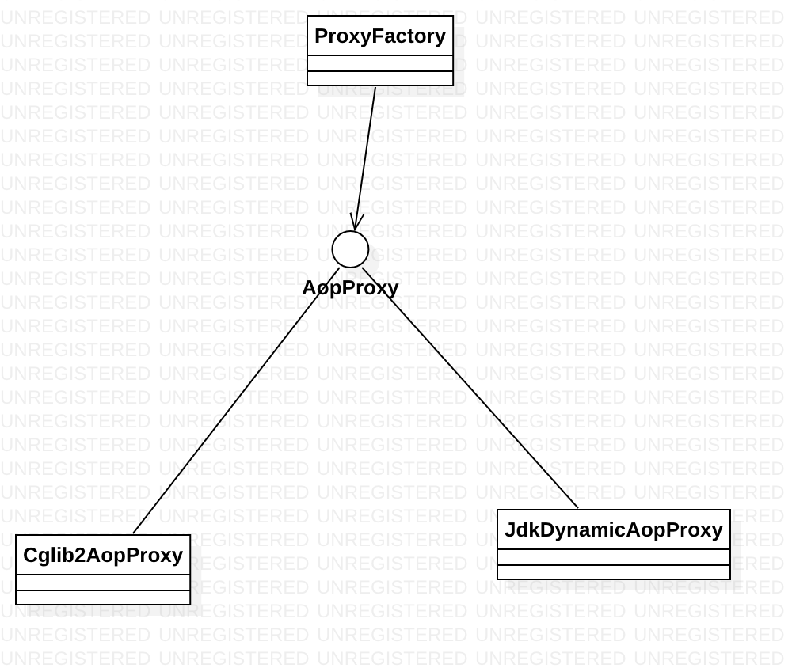

# SpringAOP基础

[toc]

## 一、AOP的术语

AOP是Aspect Oriented Programing的简称，“面向切面编程”。

### 1.1 连接点(Joinpoint)

连接点由两部分组成：一是程序的执行点；二是相对位置表示的方位。

> 例如：Test.foo() 方法执行前的连接点，执行点为Test.foo()， 方位为该方法执行前的位置。

**Spring仅支持方法的连接点**

### 1.2 切点(Pointcut)

切点相当于连接点的查询条件。

### 1.3 增强（或通知）(Advice)

**增强（Advice）**是织入目标类连接点上的一段代码。

### 1.4 目标对象(Target)

增强逻辑织入的目标类。

### 1.5 引介 （Introduction）

引介是一种特殊的增强，它为类添加一些属性和方法。

### 1.6 织入（Weaving)

织入是将增强添加到目标类的具体连接点上的过程。

AOP有三种织入的方式：

- 编译期织入，要求使用特殊的Java编译器；
- 类装载期织入，要求使用特殊的类装载器。
- 动态代理织入，在运行期为目标类添加增强生成子类的方式。

**Spring采用动态代理织入，而AspectJ采用编译期织入和类装载器织入**

### 1.7 代理（Proxy）

一个类被AOP织入增强后，就产生了一个结果类，它是融合了原类和增强逻辑的代理类。

### 1.8 切面(Aspect)

切面由切点和增强（引介）组成，它既包括横切逻辑的定义，也包括连接点点定义。

## 二、Spring AOP的动态代理

### 2.1 基于JDK的动态代理

**使用JDK创建代理有一个限制——它只能为接口创建代理实例。**

之前写过一篇文章，关于动态代理的图：[动态代理的类图](https://blog.csdn.net/hefrankeleyn/article/details/99702583#t13)。

```java
/**
 * @Date 2020/6/7
 * @Author lifei
 */
public class PerformanceHandler implements InvocationHandler {

    private Object target;
    public PerformanceHandler(Object target){
        this.target = target;
    }
    @Override
    public Object invoke(Object proxy, Method method, Object[] args) throws Throwable {
        PerformanceMonitor.begin(target.getClass().getName()+"." + method.getName());
        Object obj = method.invoke(target, args);
        PerformanceMonitor.end();
        return obj;
    }
}
```

```java
    @Test
    public void jdkDynamicProxy(){
        ForumService target = new ForumServiceImpl();
        PerformanceHandler performanceHandler = new PerformanceHandler(target);
        ForumService proxy = (ForumService) Proxy.newProxyInstance(target.getClass().getClassLoader(), target.getClass().getInterfaces(), performanceHandler);
        proxy.removeForum(10);
        proxy.removeTopic(10);
    }
```

### 2.2 基于CGLib的动态代理

**CGLib采用底层的字节码技术，为一个类创建子类。**

```java
/**
 * @since  2020/6/7
 * @author lifei
 */
public class CglibProxy implements MethodInterceptor {

    private Enhancer enhancer = new Enhancer();

    /**
     * 为一个类创建动态代理对象
     * @param clazz
     * @return
     */
    public Object getProxy(Class clazz){
        enhancer.setSuperclass(clazz);
        enhancer.setCallback(this);
        return enhancer.create();
    }
    @Override
    public Object intercept(Object o, Method method, Object[] args, MethodProxy methodProxy) throws Throwable {
        PerformanceMonitor.begin(o.getClass().getName() + "." + method.getName());
        Object result = methodProxy.invokeSuper(o, args);
        PerformanceMonitor.end();
        return result;
    }
}
```

```java
    @Test
    public void cglibProxy(){
        CglibProxy proxy = new CglibProxy();
        ForumService forumService = (ForumService) proxy.getProxy(ForumServiceImpl.class);
        forumService.removeTopic(10);
        forumService.removeForum(10);
    }
```

## 三、创建增强

```java
public interface Waiter {
    void greetTo(String name);
    void serveTo(String name);
}

```

### 3.1 前置增强

```java
/**
 * @Date 2020/6/7
 * @Author lifei
 */
public class GreetingBeforeAdvice implements MethodBeforeAdvice {
    @Override
    public void before(Method method, Object[] args, Object o) throws Throwable {
        String clientName = (String)args[0];
        System.out.println("How are you! Mr. " + clientName + ".");
    }
}
```

```java
    @Test
    public void before(){
        Waiter target = new NativeWaiter();
        BeforeAdvice beforeAdvice = new GreetingBeforeAdvice();
        ProxyFactory pf = new ProxyFactory();

        // 设置代理目标
        pf.setTarget(target);
        // 为代理目标添加增强
        pf.addAdvice(beforeAdvice);
        Waiter waiter = (Waiter) pf.getProxy();
        waiter.greetTo("XiaoMing");
        waiter.serveTo("XiaoHong");
    }
```

#### （1）`ProxyFactory`

如果通过`ProxyFactory`的`setInterfaces(Class[] interfaces)`方法指定目标接口进行代理，则`ProxyFactory`使用`JdkDynamicAopProxy`；如果是针对类的代理，则使用`Cglib2AopProxy`。
此外，通过`ProxyFactory`的	`setOptimize(true)`方法让`ProxyFactory`启动优化代理方式，这样，针对接口的代理也会使用 `setOptimize(true)`方法让ProxyFactory启动优化处理方式，针对接口的代理也会使用`Cglib2AopProxy`。



#### （2） 在Spring中的配置

```xml
    <bean id="greetingBeforeAdvice" class="com.hef.advice.GreetingBeforeAdvice"/>
    <bean id="target" class="com.hef.service.impl.NativeWaiter"/>

    <bean id="waiter" class="org.springframework.aop.framework.ProxyFactoryBean"
          p:proxyInterfaces="com.hef.service.Waiter"
          p:interceptorNames="greetingBeforeAdvice" p:target-ref="target"/>
```

```java
    @Test
    public void beforeContext(){
        ApplicationContext context = new ClassPathXmlApplicationContext("beans.xml");
        Waiter waiter = (Waiter) context.getBean("waiter");
        waiter.greetTo("xiaoMing");
    }
```

### 3.2 后置增强

```java
<!--    前置增强-->
    <bean id="greetingBeforeAdvice" class="com.hef.advice.GreetingBeforeAdvice"/>
<!--    后置增强-->
    <bean id="greetingAfterAdvice" class="com.hef.advice.GreetingAfterAdvice"/>

<!--    目标对象-->
    <bean id="target" class="com.hef.service.impl.NativeWaiter"/>

<!--    为目标对象添加后置和前置增强-->
    <bean id="waiter" class="org.springframework.aop.framework.ProxyFactoryBean"
          p:proxyInterfaces="com.hef.service.Waiter"
          p:interceptorNames="greetingBeforeAdvice,greetingAfterAdvice" p:target-ref="target"/>
```

### 3.3 环绕增强

环绕增强：允许在目标类方法调用前后织入横切逻辑。

```java
/**
 * 环绕增强
 * @author lifei
 * @since 2020/6/9
 */
public class GreetingInterceptor implements MethodInterceptor {
    @Override
    public Object invoke(MethodInvocation methodInvocation) throws Throwable {
        // 目标方法的入参
        Object[] args = methodInvocation.getArguments();
        String clientName = (String)args[0];
        // 在目标方法执行前调用
        System.out.println("How are you! Mr." + clientName + ".");
        // 通过反射机制调用目标方法
        Object obj = methodInvocation.proceed();
        // 在目标方法执行后调用
        System.out.println("Place enjoy yourself!");
        return obj;
    }
}
```

```xml
<!--    环绕增强-->
    <bean id="greetingInterceptor" class="com.hef.advice.GreetingInterceptor"/>
<!--    使用环绕增强代替前置增强和后置增强-->
    <bean id="waiter02" class="org.springframework.aop.framework.ProxyFactoryBean"
          p:proxyInterfaces="com.hef.service.Waiter"
          p:interceptorNames="greetingInterceptor" p:target-ref="target"/>
```

### 3.4 异常抛出增强

```java
/**
 * throwsAdvice 是一个标签接口
 * @author lifei
 * @since 2020/6/10
 */
public class GreetingThrowAdvice implements ThrowsAdvice {

    /**
     * 方法名必须为 afterThrowing ,前三个入参可选，要么提供，要么不提供。而最后一个是 Throwable或子类
     * @param method
     * @param args
     * @param target
     * @param exc
     */
    public void afterThrowing(Method method, Object[] args, Object target, Exception exc){
        System.out.println("--------");
        System.out.println("method: " + method.getName());
        System.out.println("抛出异常： " + exc.getLocalizedMessage());
        System.out.println("成功回滚事务！");
    }
}

```

```xml
<!--    发生异常的目标对象-->
    <bean id="exceptionTarget" class="com.hef.service.impl.ExceptionForum"/>
<!--    异常增强-->
    <bean id="greetingThrowAdvice" class="com.hef.advice.GreetingThrowAdvice"/>
<!--  使用异常增强 -->
    <bean id="exceptionForum" class="org.springframework.aop.framework.ProxyFactoryBean"
          p:proxyInterfaces="com.hef.service.ForumService"
          p:interceptorNames="greetingThrowAdvice" p:target-ref="exceptionTarget"/>
```

```java
    @Test
    public void throwContext(){
        ApplicationContext context = new ClassPathXmlApplicationContext("beans.xml");
        ForumService exceptionForum = (ForumService) context.getBean("exceptionForum");
        exceptionForum.removeForum(23);
    }
```

### 3.5 引介增强

一种特殊的增强，可以为目标类创建实现某接口的代理。

```xml
<!--    引介增强-->
    <bean id="controllablePerformanceMonitor" class="com.hef.advice.ControllablePerformanceMonitor"/>
<!--    目标对象-->
    <bean id="forumService" class="com.hef.service.impl.ForumServiceImpl"/>
<!--    使用引介增强, 由于引介增强一定要通过创建子类来生成代理，所以需要强制使用CGLib， 否则会报错-->
    <bean id="monitorService" class="org.springframework.aop.framework.ProxyFactoryBean"
          p:interfaces="com.hef.service.MonitorAble"
          p:interceptorNames="controllablePerformanceMonitor"
          p:target-ref="forumService"
          p:proxyTargetClass="true"/>
```

```java
/**
 * @author lifei
 * @since 2020/6/10
 */
public interface MonitorAble {
    void setMonitorActive(boolean active);
}

```

```java
/**
 * 引介增强
 * @author lifei
 * @since 2020/6/10
 */
public class ControllablePerformanceMonitor extends DelegatingIntroductionInterceptor implements MonitorAble {

    private ThreadLocal<Boolean> monitorStatusMap = new ThreadLocal<>();
    @Override
    public void setMonitorActive(boolean active) {
        monitorStatusMap.set(active);
    }
    @Override
    public Object invoke(MethodInvocation mi) throws Throwable {
        Object obj = null;
        // 对于支持性能监控可控代理，通过判断其状态决定是是否开启性能监控功能
        if (monitorStatusMap.get()!=null && monitorStatusMap.get()){
            PerformanceMonitor.begin(mi.getClass().getName() + "." + mi.getMethod().getName());
            obj = super.invoke(mi);
            PerformanceMonitor.end();
        }else {
            obj = super.invoke(mi);
        }
        return obj;
    }
}
```

```java
    @Test
    public void introduceContext(){
        ApplicationContext context = new ClassPathXmlApplicationContext("beans.xml");
        ForumService exceptionForum = (ForumService) context.getBean("monitorService");
        exceptionForum.removeForum(23);

        MonitorAble monitorAble = (MonitorAble) exceptionForum;
        monitorAble.setMonitorActive(true);
        exceptionForum.removeForum(23);
    }
```


## 四、创建切面

切点和增强的结合就是切面。

### 4.1 切点类型

- 静态方法切点
- 动态方法切点
- 注解切点
- 表达式切点
- 流程切点
- 复合切点

### 4.2 切面类型

#### （1）一般切面(`Advisor`)

#### （2）切点切面(`PointcutAdvisor`)

- `DefaultPointcutAdvisor`
- `NameMatchMethodPointcutAdvisor`
- `RegexpMethodPointcutAdvisor`
- `StaticMethodMatcherPointcutAdvisor`
- `AspectExpressionPointcutAdvisor`
- `AspectJPointcutAdvisor`

#### （3）引介切面(`IntroductionAdvisor`)

### 4.3 切面类型实例

#### (1) 静态普通方法名匹配切面

```java
/**
 * 定义切点
 * @author lifei
 * @since 2020/6/14
 */
public class GreetingAdvisor extends StaticMethodMatcherPointcutAdvisor {
    @Override
    public boolean matches(Method method, Class<?> targetClass) {
        return "greetTo".equals(method.getName());
    }

    @Override
    public ClassFilter getClassFilter() {
        return (clazz)->{return Waiter.class.isAssignableFrom(clazz);};
    }
}
```

```java
/**
 * 定义增强
 * @Date 2020/6/7
 * @Author lifei
 */
public class GreetingBeforeAdvice implements MethodBeforeAdvice {
    @Override
    public void before(Method method, Object[] args, Object o) {
        System.out.println("前置增强开始运行...");
        System.out.println(o.getClass() + "." + method.getName());
        String clientName = (String)args[0];
        System.out.println("How are you! Mr. " + clientName + ".");
        System.out.println("前置增强运行完成！");
    }
}
```

```xml
<!--    前置增强-->
    <bean id="greetingBeforeAdvice" class="com.hef.advice.GreetingBeforeAdvice"/>
<!--    切点,  并向切点注入一个增强 -->
    <bean id="greetingAdvisor" class="com.hef.advice.GreetingAdvisor"
          p:advice-ref="greetingBeforeAdvice"/>
<!--    目标对象-->
    <bean id="waiterTarget" class="com.hef.service.impl.NativeWaiter"/>
    <bean id="sellerTarget" class="com.hef.service.impl.NativeSeller"/>

<!--    通过一个父<bean>定义公共的配置信息-->
    <bean id="parent" abstract="true" class="org.springframework.aop.framework.ProxyFactoryBean"
          p:interceptorNames="greetingAdvisor"
          p:proxyTargetClass="true"/>
<!--    waiter代理-->
    <bean id="waiter" parent="parent" p:target-ref="waiterTarget"/>
<!--    seller 代理-->
    <bean id="seller" parent="parent" p:target-ref="sellerTarget"/>
```

```java
        ApplicationContext context = new ClassPathXmlApplicationContext("classpath:beansAdvisor.xml");
        // 发现增强只在 Waiter 上生效
        Waiter waiter = context.getBean("waiter", Waiter.class);
        waiter.greetTo("dream...");
        Seller seller = context.getBean("seller", Seller.class);
        seller.greetTo("seller run..");
```

#### （2）静态正则表达式方法匹配切面

​	`RegexpMethodPointcutAdvisor`功能比较完备，一般无须扩展该类。

### 4.4 动态切面

> 在生成织入切面的代理对象后，第一次调用代理类的每一方法时都会进行一次静态切点检查;如果本地检查就能从候选者列表中将方法排除，则以后对该方法对调用就不再执行静态切点检查；对于哪些在静态切点检查时匹配的方法，在后续调用该方法时，将执行动态切点检查。

在定义动态切点时，切勿忘记同时覆盖`getClassFilter()`和`match(Method method)`方法，通过静态切点检查排除大部分方法。

### 4.5 流程切面

举例说明流程切面：

使用`WaiterDelegate`代理`Waiter` 。直接调用`Waiter`的方法，不使用增强。通过`WaiterDelegate`来间接调用`Waiter`的时候，使用增强。

### 4.6 复合切点

```java
/**
 * @author lifei
 * @since 2020/6/21
 */
public class ComposableAdvisorApp {

    public static void main(String[] args) {
        ApplicationContext context = new ClassPathXmlApplicationContext("beansComposableAdvisor.xml");
        Waiter waiter = context.getBean("waiter05", Waiter.class);
        WaiterDelegate waiterDelegate = new WaiterDelegate();
        waiterDelegate.setWaiter(waiter);

        waiter.serveTo("Peter");
        waiter.greetTo("Peter");

        waiterDelegate.service("Peter");
    }
}
```

```xml
<!--    前置增强-->
    <bean id="greetingBeforeAdvice" class="com.hef.advice.GreetingBeforeAdvice"/>
    <bean id="gcp" class="com.hef.advice.GreetingComposablePointcut"/>
<!--    目标对象-->
    <bean id="waiterTarget" class="com.hef.service.impl.NativeWaiter"/>
<!--    引用gcp.getIntersectionPointcut() 方法返回的复合切点-->
    <bean id="composableAdvice"
          class="org.springframework.aop.support.DefaultPointcutAdvisor"
          p:pointcut="#{gcp.intersectionPointcut}"
          p:advice-ref="greetingBeforeAdvice">
    </bean>
    <bean id="waiter05" class="org.springframework.aop.framework.ProxyFactoryBean"
          p:interceptorNames="composableAdvice"
          p:target-ref="waiterTarget"
          p:proxyTargetClass="true"/>
```

### 4.7 引介增强

```xml
    <bean id="introduceAdvisor" class="org.springframework.aop.support.DefaultIntroductionAdvisor">
        <constructor-arg>
            <bean class="com.hef.advice.ControllablePerformanceMonitor"/>
        </constructor-arg>
    </bean>

    <bean id="forumServiceTarget" class="com.hef.service.impl.ForumServiceImpl"/>
    <bean id="forumService" class="org.springframework.aop.framework.ProxyFactoryBean"
          p:interceptorNames="introduceAdvisor"
          p:target-ref="forumServiceTarget"
          p:proxyTargetClass="true"/>
```

## 五、自动代理创建器

在上面的例子中，都通过`ProxyFactoryBean`创建织入切面的代理。

Spring提供了自动代理机制，让容器自动生成代理。在内部，Spring使用`BeanPostProcessor`自动完成这项工作。

### 5.1 `BeanNameAutoProxyCreator`

```xml
    <!--    前置增强-->
    <bean id="greetingBeforeAdvice" class="com.hef.advice.GreetingBeforeAdvice"/>
    <!--    目标对象-->
    <bean id="waiterTarget" class="com.hef.service.impl.NativeWaiter"/>
    <bean id="sellerTarget" class="com.hef.service.impl.NativeSeller"/>

    <bean class="org.springframework.aop.framework.autoproxy.BeanNameAutoProxyCreator"
          p:beanNames="*erTarget"
          p:interceptorNames="greetingBeforeAdvice"
          p:optimize="true"/>  /* 强制使用 cglib */
```

### 5.2 `DefaultAdvisorAutoProxyCreator`

`DefaultAdvisorAutoProxyCreator` 能够自动扫描容器中的所有切面（Advisor），为目标类自动创建代理。

```xml
    <!--    前置增强-->
    <bean id="greetingBeforeAdvice" class="com.hef.advice.GreetingBeforeAdvice"/>
    <!--    目标对象-->
    <bean id="sellerTarget" class="com.hef.service.impl.ProblemSeller"/>

    <!--   定义切面 -->
    <bean id="regexpAdvisor"
          class="org.springframework.aop.support.RegexpMethodPointcutAdvisor"
          p:advice-ref="greetingBeforeAdvice" p:patterns=".*To.*"/>

    <bean class="org.springframework.aop.framework.autoproxy.DefaultAdvisorAutoProxyCreator"
          p:proxyTargetClass="true"/>
```

